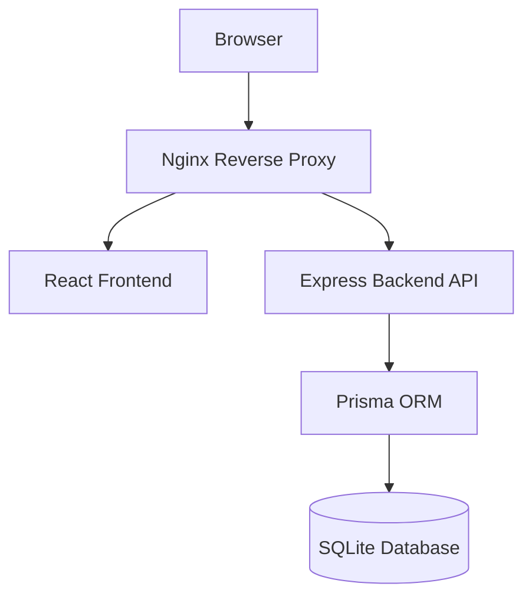

# SmartHostel

Production-focused hostel management platform engineered with modern DevOps practices, containerized deployment architecture, CI/CD validation workflows, and operational infrastructure design.

SmartHostel began as a traditional academic hostel management system and was later redesigned into a deployment-oriented engineering project focused on infrastructure reliability, runtime consistency, and production-style orchestration patterns.

---

## Overview

SmartHostel handles common operational workflows required in residential hostel environments while emphasizing realistic deployment engineering and maintainable infrastructure.

Current platform capabilities include:

- Resident onboarding and management
- Room allocation and occupancy tracking
- Attendance monitoring
- Visitor logging
- Billing and fee tracking
- Maintenance request workflows
- Inventory management
- Mess subscription handling
- Occupancy analytics and forecasting

The system is structured as a modular containerized platform designed for local orchestration today and cloud-native expansion later.

---

# Architecture



---

# Tech Stack

## Frontend

- React 19
- Vite 7
- TypeScript
- TailwindCSS
- Recharts
- Lucide React

---

## Backend

- Node.js
- Express 5
- TypeScript
- Prisma ORM
- JWT Authentication
- bcrypt password hashing

---

## Infrastructure & DevOps

- Docker
- Docker Compose
- Kubernetes
- GitHub Actions
- Nginx Reverse Proxy
- GHCR Container Registry
- Helm
- Terraform

---

# Repository Structure

```text
.
├── backend
│   ├── prisma
│   ├── src
│   ├── Dockerfile
│   └── package.json
│
├── frontend
│   ├── src
│   ├── nginx.conf
│   ├── Dockerfile
│   └── package.json
│
├── .github
│   └── workflows
│
├── docker-compose.yml
├── docker-compose.override.yml
│
├── k8s
├── helm
├── terraform
│
└── docs
```

---

# Infrastructure Engineering

## Multi-Stage Docker Builds

Both frontend and backend services use optimized multi-stage Docker builds to improve runtime efficiency and deployment consistency.

Implemented optimizations include:

- isolated dependency layers
- deterministic installs
- minimized runtime image footprint
- production-only dependencies
- reduced build context
- cleaner runtime separation

---

## Backend Runtime Optimization

```text
Initial Backend Image Size : 1.81 GB
Optimized Runtime Size     : 383 MB
Overall Reduction          : 79%
```

---

## Runtime Hardening

Implemented runtime controls include:

- non-root container execution
- isolated runtime stages
- internal service networking
- environment-driven configuration
- reduced attack surface
- dependency separation

---

## Reverse Proxy Networking

Nginx is used as an internal reverse proxy layer to:

- serve frontend static assets
- internally proxy `/api` requests
- avoid frontend/backend CORS issues
- support SPA routing
- improve network isolation
- enable gzip compression

---

# CI/CD Pipeline

GitHub Actions workflows enforce automated validation across the project.

Current pipeline stages include:

- TypeScript validation
- frontend build verification
- backend build verification
- Docker image build checks
- workflow validation
- runtime consistency validation

The pipeline intentionally fails on validation errors instead of suppressing infrastructure problems.

---

# Kubernetes Deployment

The repository includes Kubernetes manifests for local orchestration testing using Minikube.

Validated components include:

- Deployments
- Services
- Secrets
- environment injection
- pod lifecycle handling
- internal service networking

Current Kubernetes maturity is experimental and focused on deployment validation rather than production hosting.

---

# Operational Challenges Solved

## Prisma Schema Drift

One major issue discovered during containerized deployment involved Prisma schema drift where runtime models no longer matched generated Prisma clients.

This surfaced during Docker validation and Kubernetes deployment testing, reinforcing the importance of reproducible builds and strict schema synchronization.

---

## Runtime Environment Injection

Authentication initially failed because `DATABASE_URL` was not correctly injected into Kubernetes runtime environments.

The issue was resolved using:

- Kubernetes Secrets
- runtime environment variables
- deployment configuration cleanup

---

## Reverse Proxy API Routing

Frontend authentication failures were traced to incorrect API routing behavior between frontend and backend services.

The issue was resolved through:

- internal Nginx proxying
- environment normalization
- runtime endpoint correction
- service networking cleanup

---

## Kubernetes Image Pull Issues

Local Kubernetes deployment initially encountered:

```text
ErrImageNeverPull
```

The issue was resolved using:

- Minikube local image loading
- corrected image pull policies
- deployment rollout synchronization
- runtime image validation

---

# Predictive Analytics

SmartHostel currently includes lightweight occupancy forecasting features using:

- Moving Average models
- Linear Regression analysis

These are used for occupancy estimation and operational planning.

The project intentionally avoids overstating AI capabilities or integrating unnecessary external LLM tooling.

---

# DevOps Capabilities

| Capability | Status |
|---|---|
| Dockerized Architecture | Active |
| Multi-Stage Builds | Active |
| GitHub Actions CI/CD | Active |
| Nginx Reverse Proxy | Active |
| JWT Authentication | Active |
| SQLite Persistence | Active |
| Kubernetes Validation | Experimental |
| Helm Charts | Scaffolded |
| Terraform Infrastructure | Scaffolded |
| GHCR Publishing | Active |
| Runtime Health Validation | Active |

---

# Local Development

## Clone Repository

```bash
git clone https://github.com/Piyushkhobragade/SmartHostel.git

cd SmartHostel
```

---

## Start Using Docker Compose

```bash
docker compose up --build
```

Application becomes available at:

```text
http://localhost
```

---

# Kubernetes Local Deployment

## Apply Kubernetes Resources

```bash
kubectl apply -f k8s/
```

---

## Verify Pods

```bash
kubectl get pods
```

---

## Verify Services

```bash
kubectl get svc
```

---

# Development Workflow

Development overrides are separated using:

```text
docker-compose.override.yml
```

This enables:

- bind-mounted source code
- hot reload support
- development-only port exposure
- isolated production runtime logic

---

# Authentication & Authorization

Authentication is implemented using JWT-based authorization.

Implemented features include:

- bcrypt password hashing
- protected API routes
- role-based access control
- token validation middleware
- frontend request interception
- ADMIN authorization flows

---

# Design Decisions

## Why SQLite?

SQLite is intentionally retained because it accurately reflects the current operational maturity of the platform.

Advantages at the current stage include:

- simplified reproducibility
- lower infrastructure overhead
- deterministic local deployments
- reduced operational complexity

PostgreSQL migration is planned for future cloud deployment phases.

---

## Why `node:20-bookworm` Instead of Alpine?

Prisma runtime compatibility issues under Alpine/musl environments caused instability during container validation.

The backend runtime was standardized on:

```text
node:20-bookworm
```

to improve:

- OpenSSL compatibility
- Prisma runtime stability
- deterministic builds
- deployment reliability

---

# Future Direction

Planned expansion areas include:

- PostgreSQL migration
- production Kubernetes orchestration
- cloud deployment automation
- centralized observability
- Prometheus and Grafana integration
- AI-assisted allocation workflows
- infrastructure monitoring
- distributed logging
- RBAC expansion

---

# Engineering Philosophy

This repository intentionally prioritizes:

- operational clarity
- realistic infrastructure
- maintainable deployment architecture
- deterministic builds
- incremental modernization
- reproducible environments
- infrastructure honesty

over unnecessary complexity or artificial tooling inflation.

---

# Author

Developed and maintained by **Piyush Khobragade**.

SmartHostel is continuously evolving as a hands-on platform engineering and DevOps modernization project focused on practical containerization, deployment workflows, CI/CD enforcement, and infrastructure reliability.

GitHub:

```text
https://github.com/Piyushkhobragade
```

---

# License

This project is currently maintained as an academic and infrastructure-engineering showcase platform.
